# Face Yoga Progress Tracker Architecture

## System Architecture

### High-Level Overview

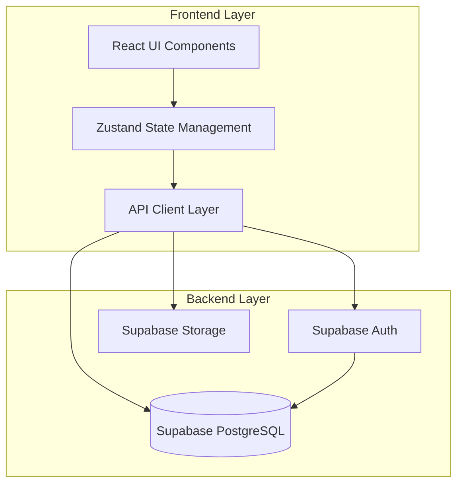

### Authentication Flow

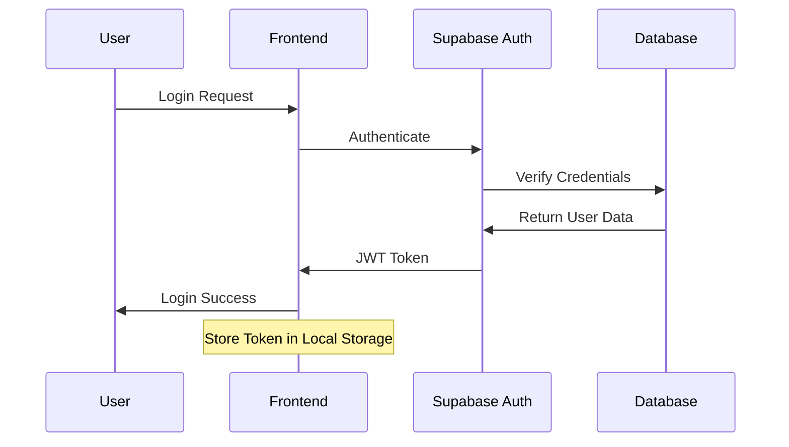

### Exercise Management Flow

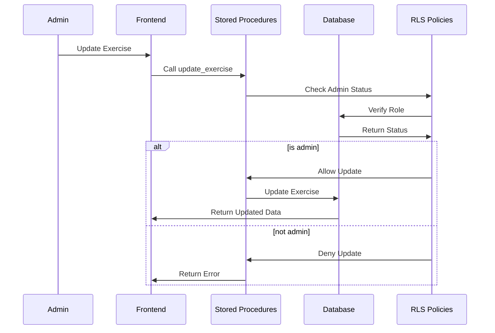

### Data Access Control

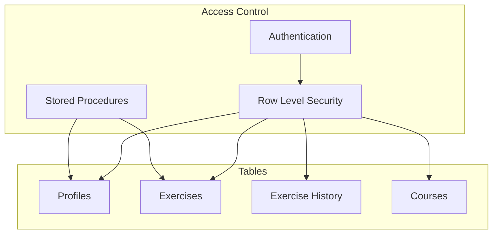

## Component Architecture

### Frontend Structure

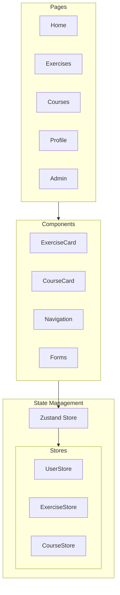

### State Management Flow

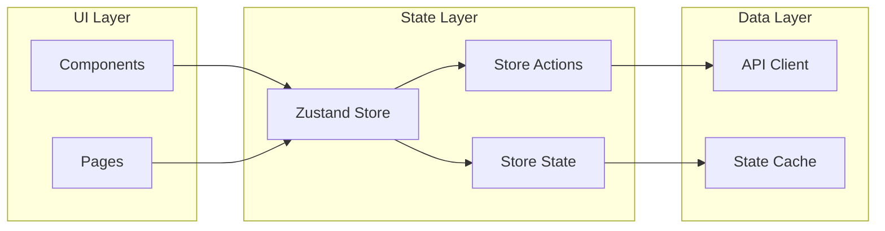

## Database Schema

### Core Tables Relationship

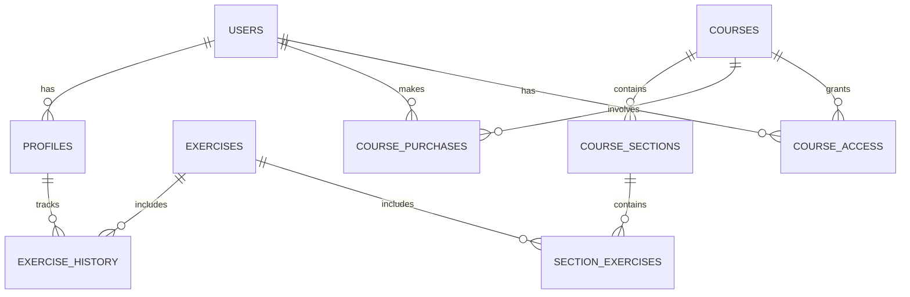

## Security Architecture

### Row Level Security Flow

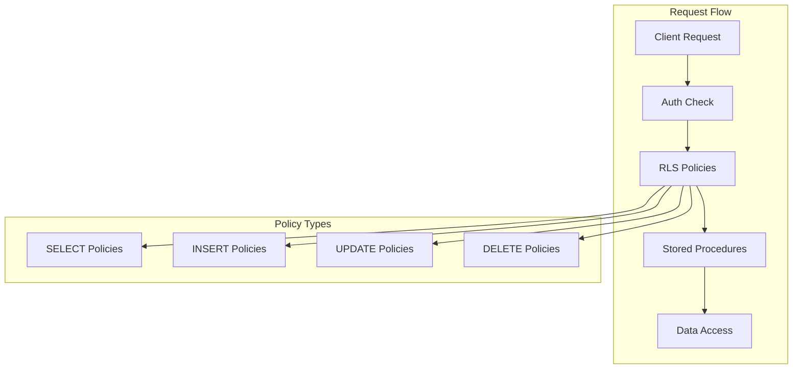

## Deployment Architecture

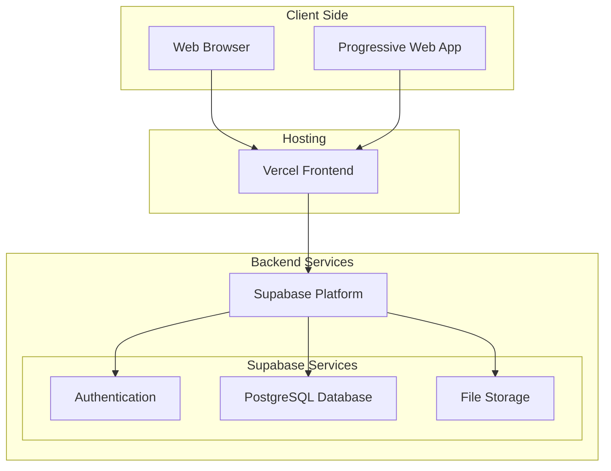

## Implementation Details

### Exercise Update Flow

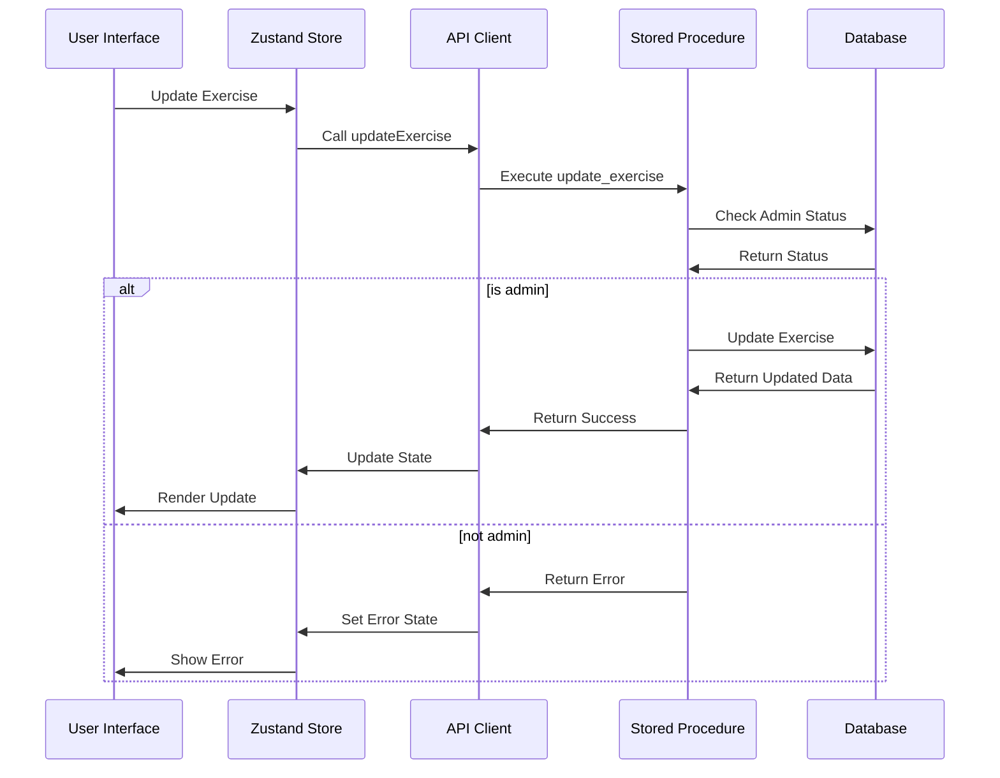

## Performance Considerations

### Data Loading Strategy

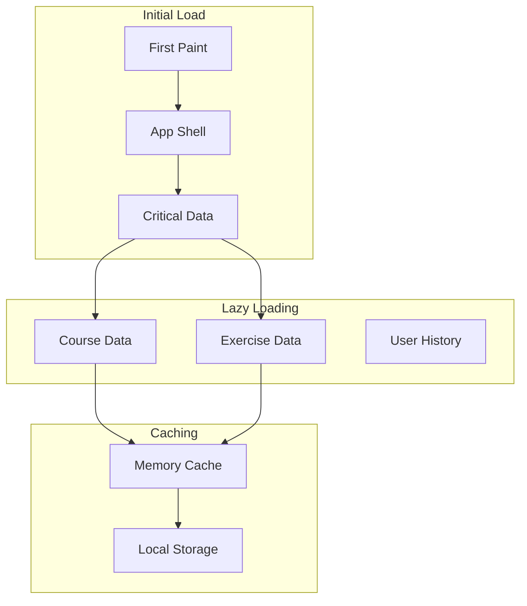

## Error Handling

### Error Flow

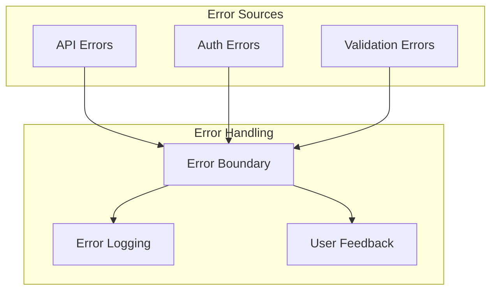

## Future Considerations

### Planned Improvements

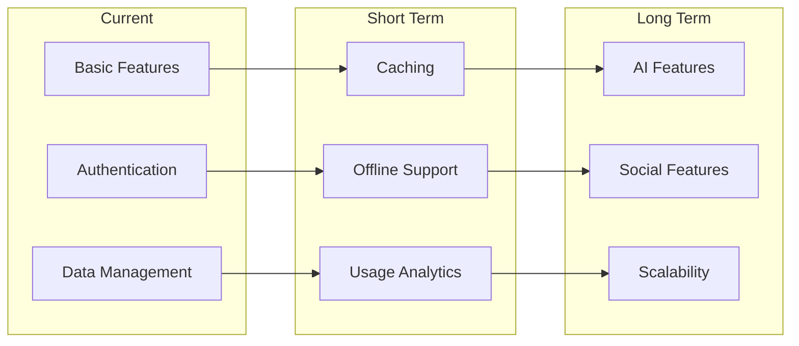