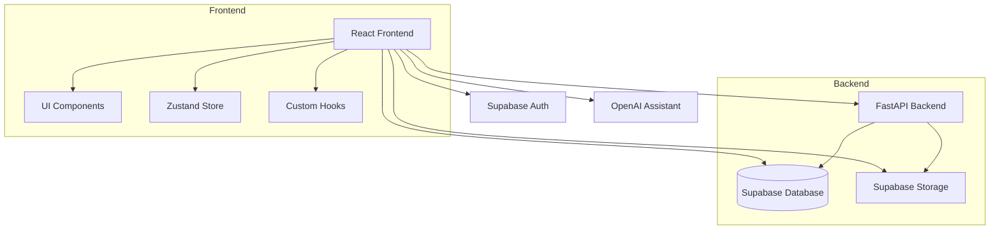
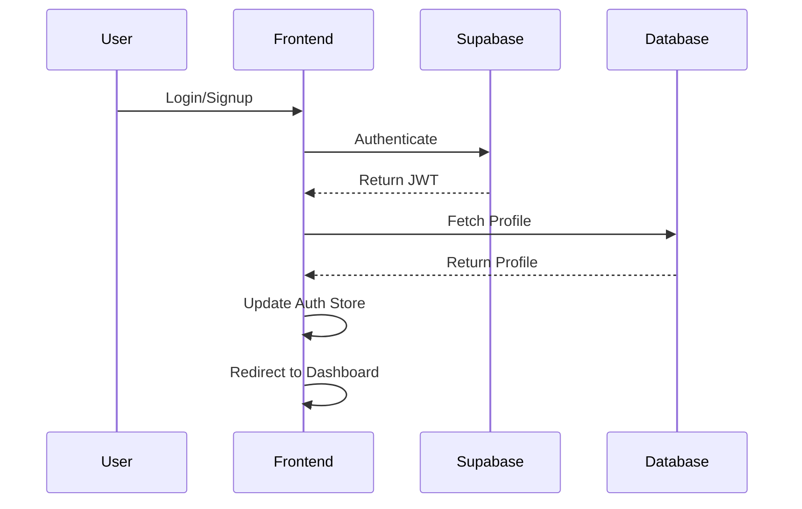
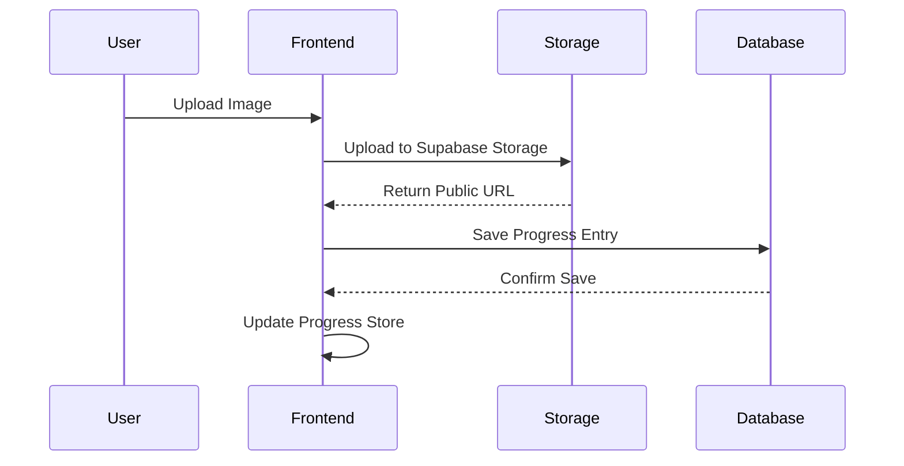

# Face Yoga Progress Tracker - Technical Documentation

## Architecture Overview



## Tech Stack

- **Frontend**
  - React 18.3.1
  - TypeScript
  - Tailwind CSS
  - Zustand (State Management)
  - Lucide React (Icons)
  - React Router DOM
  - Vite (Build Tool)

- **Backend**
  - FastAPI
  - Python 3.x
  - Supabase
    - PostgreSQL Database
    - Authentication
    - Storage
  - OpenAI API (AI Coach)

## Project Structure

```
src/
├── components/        # Reusable UI components
├── hooks/            # Custom React hooks
├── lib/              # Core utilities and API clients
├── pages/            # Page components
├── store/            # Global state management
└── types/            # TypeScript type definitions

api/                  # FastAPI backend
├── main.py          # Main API entry point
└── requirements.txt  # Python dependencies

docs/                # Documentation
└── README.md        # This file

supabase/
└── migrations/      # Database migrations
```

## Database Schema

### Profiles
```sql
CREATE TABLE profiles (
    id UUID PRIMARY KEY,
    user_id UUID REFERENCES auth.users,
    email TEXT,
    username TEXT,
    full_name TEXT,
    avatar_url TEXT,
    role TEXT DEFAULT 'user',
    streak INTEGER DEFAULT 0,
    exercises_done INTEGER DEFAULT 0,
    practice_time FLOAT DEFAULT 0
);
```

### Exercises
```sql
CREATE TABLE exercises (
    id UUID PRIMARY KEY,
    title TEXT,
    duration TEXT,
    target_area TEXT,
    description TEXT,
    image_url TEXT,
    video_url TEXT,
    category TEXT,
    difficulty TEXT,
    instructions TEXT[],
    benefits TEXT[]
);
```

### Courses
```sql
CREATE TABLE courses (
    id UUID PRIMARY KEY,
    title TEXT,
    description TEXT,
    image_url TEXT,
    difficulty TEXT,
    duration TEXT
);
```

### Course Sections
```sql
CREATE TABLE course_sections (
    id UUID PRIMARY KEY,
    course_id UUID REFERENCES courses,
    title TEXT,
    description TEXT,
    order_index INTEGER
);
```

### Section Exercises
```sql
CREATE TABLE section_exercises (
    id UUID PRIMARY KEY,
    section_id UUID REFERENCES course_sections,
    exercise_id UUID REFERENCES exercises,
    order_index INTEGER
);
```

## State Management

The application uses Zustand for state management with the following stores:

- `authStore`: Manages user authentication state
- `profileStore`: Handles user profile data
- `exerciseStore`: Manages exercise data and operations
- `courseStore`: Handles course-related state
- `chatStore`: Manages AI coach chat interactions
- `progressStore`: Tracks user progress and photos

## Authentication Flow



## File Upload Flow



## API Integration

### Supabase Client Setup
```typescript
import { createClient } from '@supabase/supabase-js';

const supabaseUrl = import.meta.env.VITE_SUPABASE_URL;
const supabaseKey = import.meta.env.VITE_SUPABASE_ANON_KEY;

export const supabase = createClient(supabaseUrl, supabaseKey, {
  auth: {
    autoRefreshToken: true,
    persistSession: true,
    detectSessionInUrl: true
  }
});
```

### OpenAI Integration
```typescript
import OpenAI from 'openai';

const openai = new OpenAI({
  apiKey: import.meta.env.VITE_OPENAI_API_KEY,
  dangerouslyAllowBrowser: true
});
```

## Environment Variables

Required environment variables:

```env
VITE_SUPABASE_URL='your_supabase_url'
VITE_SUPABASE_ANON_KEY='your_supabase_anon_key'
VITE_OPENAI_API_KEY='your_openai_api_key'
VITE_OPENAI_ASSISTANT_ID='your_openai_assistant_id'
```

## Development Setup

1. Clone the repository
2. Install dependencies:
   ```bash
   npm install
   ```
3. Set up environment variables
4. Start development server:
   ```bash
   npm run dev
   ```

## Deployment

The application can be deployed to any static hosting service. Build the application using:

```bash
npm run build
```

## Security Considerations

1. Row Level Security (RLS) is enabled on all Supabase tables
2. File uploads are restricted by size and type
3. Admin routes are protected by role-based access control
4. API keys are properly secured in environment variables

## Testing

Run tests using:

```bash
npm run test
```

## Contributing

1. Fork the repository
2. Create a feature branch
3. Commit changes
4. Push to the branch
5. Create a Pull Request

## License

MIT License