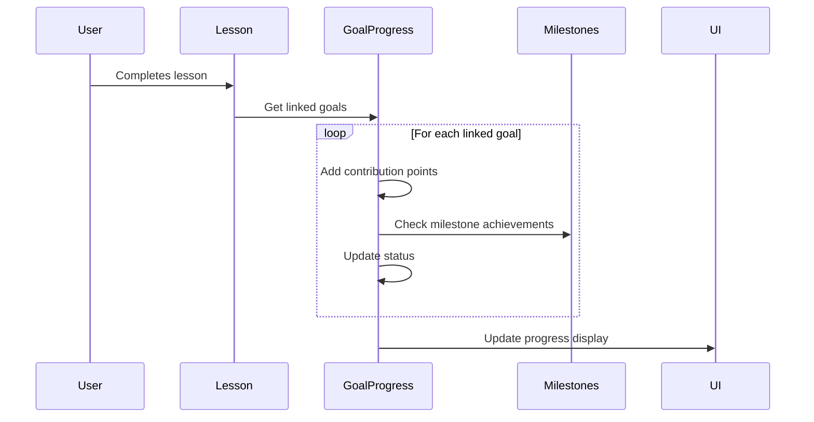

# Goals Feature Documentation

## Overview
The Goals feature allows users to set, track, and achieve face yoga practice goals. It includes milestone tracking, progress visualization, and integration with lessons.

## Features

### Goal Management
- Set personal face yoga goals
- Track progress through milestones
- View goal completion status
- Set goal difficulty levels
- Configure reminder frequency
- Set priority levels for goals

### Goal Progress Tracking
- Visual progress indicators
- Milestone achievement tracking
- Progress history
- Status updates (Not Started, In Progress, Completed, Paused)
- Notes and documentation
- Reward points system for completed milestones
- Progress-based milestone completion

### Goal Analytics
- Completion rates
- Average progress
- Time spent tracking
- Milestone achievements
- Points and rewards system
- Total reward points earned

### Lesson Integration
- Track goal progress through lesson completion
- Map lessons to goals with contribution weights
- Automatic progress updates from lessons
- Progress calculation based on lesson completion
- Related lessons display

## Implementation

### Data Model

#### Goal
```typescript
interface Goal {
  id: string;
  title: string;
  description: string;
  category: string;
  difficulty: 'beginner' | 'intermediate' | 'advanced';
  estimated_duration: string;
  points_reward: number;
  created_at: string;
}
```

#### User Goal
```typescript
interface UserGoal {
  id: string;
  user_id: string;
  goal_id: string;
  priority: number;
  start_date: string;
  target_date: string | null;
  reminder_frequency: 'daily' | 'weekly' | 'monthly' | 'none';
}
```

#### Goal Progress
```typescript
interface GoalProgress {
  id: string;
  user_id: string;
  goal_id: string;
  progress_value: number;
  milestone_reached: number;
  status: 'not_started' | 'in_progress' | 'completed' | 'paused';
  notes: string | null;
  last_updated: string;
  created_at: string;
}
```

#### Goal Milestone
```typescript
interface GoalMilestone {
  id: string;
  goal_id: string;
  title: string;
  description: string | null;
  target_value: number;
  reward_points: number;
  created_at: string;
}
```

#### Lesson Goal Mapping
```typescript
interface LessonGoalMapping {
  id: string;
  lesson_id: string;
  goal_id: string;
  contribution_weight: number;
  created_at: string;
}
```

### Progress Calculation

#### Milestone Progress
- Progress percentage = (current points / total points needed) * 100
- Milestone completion based on reaching target value
- Reward points awarded upon milestone completion
- Total points needed for goal completion = highest milestone target value

#### Lesson Progress Integration
- Each completed lesson contributes points based on its weight
- Points are automatically added to goal progress
- Multiple lessons can contribute to the same goal
- Weighted contribution allows for different lesson importance

#### Example
```typescript
// Calculate milestone completion
const isCompleted = currentProgress >= milestone.target_value;

// Calculate total reward points
const totalRewardPoints = milestones
  .filter(m => currentProgress >= m.target_value)
  .reduce((total, m) => total + m.reward_points, 0);

// Calculate lesson contribution
const lessonPoints = lessonWeight * basePoints;
const newProgress = currentProgress + lessonPoints;
```

### Key Components

#### GoalProgressCard
- Circular progress visualization
- Status indicators with color coding
- Milestone progress tracking
- Related lessons integration
- Quick status updates
- Total reward points display
- Progress-based milestone completion

#### GoalMilestones
- Milestone listing and tracking
- Progress visualization
- Reward points display
- Visual completion indicators
- Earned rewards summary
- Milestone status tracking

### State Management

The goals feature uses Zustand for state management with the following operations:

#### Progress Tracking
- `fetchGoalProgress`: Retrieve goal progress for a user
- `fetchGoalMilestones`: Get milestones for a specific goal
- `updateGoalProgress`: Update progress for a goal
- `updateGoalStatus`: Change goal status
- `trackLessonCompletion`: Track progress from completed lessons

#### Analytics
- `getGoalAnalytics`: Calculate goal-specific analytics
  - Completion rate
  - Average progress
  - Time spent

### Integration Features

#### Lesson Integration
- Track goal progress through lesson completion
- Map lessons to goals with contribution weights
- Automatic progress updates from lessons
- Progress calculation based on lesson completion
- Related lessons display

### Goal-Lesson Integration

#### Lesson Contribution System
Each lesson can be linked to multiple goals with customizable contribution weights:
```typescript
interface GoalLesson {
  id: string;
  goal_id: string;
  lesson_id: string;
  contribution_weight: number;  // Points contributed to goal progress when lesson is completed
  created_at: string;
}
```

#### Lesson Completion Flow
When a user completes a lesson, the following process occurs:

1. **Goal Progress Update**
   - System identifies all goals linked to the completed lesson
   - For each linked goal:
     - Adds the lesson's contribution weight to the goal's progress points
     - Recalculates milestone achievements based on new progress
     - Updates goal status if all milestones are reached

2. **Progress Visualization**
   - Goal progress card updates to show:
     - New progress points
     - Updated circular progress percentage
     - Current milestone achievements
     - Goal status changes

3. **Status Updates**
   - Goal status automatically changes to:
     - "in_progress" when first lesson is completed
     - "completed" when all milestones are reached

#### Example Flow


### Goal Points System

#### Points Calculation
- Each lesson can contribute different points to different goals
- Default contribution is 10 points if not specified
- Total points needed for goal completion = highest milestone target value
- Progress percentage = (current points / total points needed) * 100

#### Example
```
Goal: "Improve Face Symmetry"
Milestones:
- Basic exercises completed (30 points)
- Intermediate mastery (60 points)
- Advanced techniques (100 points)

Related Lessons:
- Basic symmetry exercises (15 points)
- Mirror technique practice (20 points)
- Advanced balancing routine (25 points)

Progress Calculation:
- Complete basic exercises = 15 points (15% progress)
- Complete mirror technique = 35 points (35% progress)
- Complete advanced routine = 60 points (60% progress)
```

### Admin Management

#### Goal Setup
Administrators can:
- Create and edit goals
- Define milestones and target points
- Link lessons to goals
- Set contribution weights for each lesson
- Manage goal categories and difficulty levels

#### Lesson Weight Configuration
In the Admin Goals interface:
1. Add related lessons to a goal
2. Set custom point values for each lesson
3. Points determine how much the lesson contributes to goal progress
4. Higher points = greater impact on goal completion

### Best Practices

#### Setting Contribution Weights
- Align points with lesson difficulty and importance
- Consider lesson duration and complexity
- Balance points across different lesson types
- Use consistent point scales across similar goals

#### Goal Structure
- Set realistic milestone targets
- Space milestones evenly
- Ensure total points are achievable
- Consider user skill progression

#### Progress Tracking
- Monitor completion rates
- Analyze point distribution
- Adjust weights if needed
- Get user feedback on progression

### Status Management

#### Status Types
- Not Started: Goal is created but no progress
- In Progress: Active goal with ongoing progress
- Completed: All milestones achieved
- Paused: Temporarily suspended progress

#### Status Visualization
```typescript
const statusColors = {
  not_started: 'bg-gray-100 text-gray-600',
  in_progress: 'bg-mint-100 text-mint-600',
  completed: 'bg-green-100 text-green-600',
  paused: 'bg-yellow-100 text-yellow-600'
};
```

## Usage

### Setting Goals
1. Navigate to Goals page
2. View available goals
3. Select goal difficulty and category
4. Set priority and reminders
5. Track progress through milestones

### Tracking Progress
1. Complete related lessons
2. View progress in circular indicator
3. Track milestone achievements
4. Update goal status as needed
5. Add progress notes

### Managing Goals
1. View all active goals
2. Update goal status
3. Check milestone progress
4. View related lessons
5. Track reward points

## Technical Notes

### Dependencies
- react-circular-progressbar: Progress visualization
- date-fns: Date handling
- Supabase: Backend storage
- Zustand: State management

### Performance Considerations
- Parallel data fetching
- Optimized progress calculations
- Efficient milestone tracking
- Responsive UI updates

### Security
- User-specific goal tracking
- Secure progress storage
- Protected milestone data
- Access control through Supabase RLS
